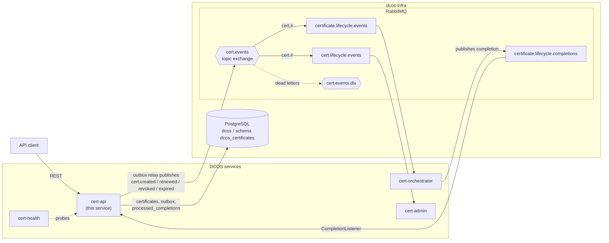
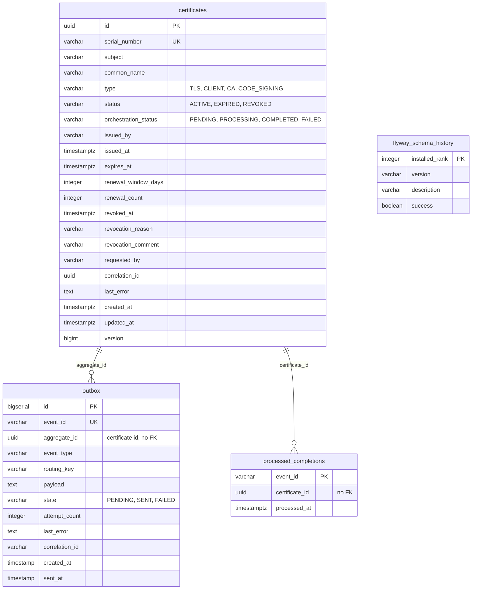

# cert-api-service

Spring Boot REST API for managing fictional certificate metadata within the DCOS (Distributed Certificate Orchestration System) platform. This service owns certificate identity and lifecycle state, publishes lifecycle events to RabbitMQ, and consumes completion notifications from the orchestrator.

**This is a domain-neutral metadata service; no real cryptography, key material, or PKI operations occur here.**

## API Endpoints

All endpoints are scoped to `/api/v1/certificates` and require HTTP Basic authentication.

| Method | Path | Auth | Status | Purpose |
|--------|------|------|--------|---------|
| POST | `/` | ADMIN | 201 / 409 | Create a new certificate |
| GET | `/` | USER or ADMIN | 200 | List certificates (paginated, filterable) |
| GET | `/{id}` | USER or ADMIN | 200 / 404 | Retrieve one certificate |
| GET | `/expiring?withinDays=30` | USER or ADMIN | 200 | Find certificates expiring soon (paginated) |
| POST | `/{id}/renew` | ADMIN | 200 / 404 / 409 | Renew an existing certificate |
| POST | `/{id}/revoke` | ADMIN | 200 / 404 / 409 | Revoke a certificate |
| GET | `/{id}/events` | USER or ADMIN | 200 / 404 | View outbox history for a certificate |

All responses use `application/json` (requests and responses) or `application/problem+json` (RFC 7807 error bodies). Timestamps are UTC ISO-8601 with `Z` suffix.

## Published Events

The service publishes four event types to the `cert.events` topic exchange, serialized as snake_case JSON. Downstream consumers subscribe via durable queues.

### CERTIFICATE_CREATED
Published when a new certificate is created.
```json
{
  "event_id": "550e8400-e29b-41d4-a716-446655440000",
  "certificate_id": "11111111-1111-4111-8111-111111111111",
  "occurred_at": "2026-09-27T10:00:00Z",
  "payload": {
    "event_type": "CERTIFICATE_CREATED",
    "serial_number": "DCOS-2026-A1B2C3D4E5F6",
    "subject": "CN=service-alpha,OU=platform,O=DCOS",
    "common_name": "service-alpha",
    "certificate_type": "TLS",
    "status": "ACTIVE",
    "issued_by": "DCOS Demo Authority",
    "issued_at": "2026-09-27T10:00:00Z",
    "expires_at": "2027-09-27T10:00:00Z",
    "renewal_window_days": 30,
    "requested_by": "admin",
    "correlation_id": "550e8400-e29b-41d4-a716-446655440000",
    "source_service": "cert-api-service",
    "schema_version": 1
  }
}
```

### CERTIFICATE_RENEWED
Published when an existing certificate is renewed. Extends the CREATED envelope with renewal metadata.
```json
{
  "event_id": "...",
  "certificate_id": "...",
  "occurred_at": "...",
  "payload": {
    "event_type": "CERTIFICATE_RENEWED",
    "...": "(same as CREATED fields)",
    "previous_expires_at": "2027-09-27T10:00:00Z",
    "expires_at": "2028-09-27T10:00:00Z",
    "renewal_count": 1
  }
}
```

### CERTIFICATE_REVOKED
Published when a certificate is revoked. Includes revocation reason and comment.
```json
{
  "event_id": "...",
  "certificate_id": "...",
  "occurred_at": "...",
  "payload": {
    "event_type": "CERTIFICATE_REVOKED",
    "...": "(same as CREATED fields)",
    "status": "REVOKED",
    "revocation_reason": "KEY_COMPROMISE",
    "revocation_comment": "rotated during demo drill",
    "revoked_at": "2026-09-27T12:00:00Z"
  }
}
```

### CERTIFICATE_EXPIRED
Published by the expiry sweep when an ACTIVE certificate passes its expiry time. The sweep runs every 5 minutes.
```json
{
  "event_id": "...",
  "certificate_id": "...",
  "occurred_at": "...",
  "payload": {
    "event_type": "CERTIFICATE_EXPIRED",
    "...": "(same as CREATED fields)",
    "status": "EXPIRED",
    "detected_at": "2026-09-27T12:00:00Z"
  }
}
```

## Running Locally

### Start the Infrastructure Stack

The service depends on PostgreSQL and RabbitMQ provided by the dcos-infra stack:

```bash
cd ../dcos-infra
cp .env.example .env
docker-compose up -d
```

This starts PostgreSQL (5432), RabbitMQ (5672, management UI on 15672), and Adminer (8080). On Windows, run these `docker` commands from PowerShell or Command Prompt, not Git Bash (Git Bash rewrites container paths).

### Create the Test Database

Before running tests, create the dedicated test database:

```bash
./scripts/setup-test-db.sh          # Linux/macOS
scripts\setup-test-db.bat           # Windows
```

The script uses environment variables with sensible defaults matching dcos-infra:
- `DB_HOST` (default: `localhost`)
- `DB_PORT` (default: `5432`)
- `DB_USER` (default: `dcos`)
- `DB_PASSWORD` (default: `changeme`)

If the test database is unreachable, tests fail with a "TEST DATABASE UNAVAILABLE" message naming this script.

### Run the Service

```bash
mvn spring-boot:run
```

The service starts on port 8080 by default. **When the dcos-infra stack is running**, Adminer (the database UI) occupies host port 8080, so the service cannot bind. To start on an alternative port:

```bash
SERVER_PORT=8081 mvn spring-boot:run
```

Spring Boot's relaxed binding accepts `SERVER_PORT` as an environment variable; no configuration file change is needed. Swagger UI is then at `http://localhost:8081/swagger-ui.html`.

### Quick Test

```bash
curl -u admin:changeme http://localhost:8081/api/v1/certificates
```

### Run Tests

```bash
mvn clean verify
```

All tests use the dedicated test database (integration tests) or mocks (unit and web-slice tests). The full suite includes:
- Unit tests of state machines, utilities, and listener logic with mocked collaborators
- Service tests with mocked repositories and event publishers
- Web-slice tests of controller status codes and validation
- Repository tests against real PostgreSQL (schema validation, constraints, queries)
- Integration tests against real PostgreSQL and RabbitMQ (end-to-end completion consumption, event publishing)

### End-to-End Verification with the Orchestrator

This procedure runs cert-api together with the Python orchestrator (`cert-orchestrator-service`, a sibling repository) against the shared dcos-infra stack. It has been run end to end: the case-insensitive status comparison in `CompletionListener` was confirmed against the orchestrator's real completions, all of which carry `status` in uppercase.

**Expected outcome:** a certificate is created as `status=ACTIVE` with `orchestrationStatus=PENDING`. Within seconds (about twelve in the reference run) the same certificate reads `status=ACTIVE`, `orchestrationStatus=COMPLETED` and no `lastError`. `status` never changes: cert-api owns `status`, and the orchestrator influences only `orchestrationStatus`.

#### 1. Start the infrastructure stack

Start the dcos-infra stack (PostgreSQL, RabbitMQ, Adminer). Run all `docker` commands from **PowerShell or Command Prompt on Windows, not Git Bash**. Git Bash rewrites container paths, which produces errors that look like Docker failures but are path conversion.

#### 2. Prepare the orchestrator

- **Create its database.** The infrastructure stack creates only the shared `dcos` database. The orchestrator's own database must be created manually before its migrations run.
- **Apply its Alembic migrations.** The orchestrator's migrations currently cannot run unmodified because of two defects on its side, reported to that repository. This procedure assumes its migrations have already been applied; consult the orchestrator repository for the current status.
- **Supply both connection strings** through the orchestrator's `CERT_ORCH_` environment prefix:
  - `CERT_ORCH_RABBITMQ_URL`, for example `amqp://<user>:<password>@localhost:5672/`. The default carries no credentials and is refused by the shared broker.
  - `CERT_ORCH_DATABASE_URL`, for example `postgresql+psycopg://<user>:<password>@localhost:5432/<orchestrator-db>`. The default has neither credentials nor the right host.

Then start the orchestrator (in the reference run it ran in a container) and confirm it is consuming.

#### 3. Start cert-api on port 8081

Adminer occupies host port 8080 while the stack is up, so cert-api cannot bind its default port. Set the server port through the environment; Spring Boot's relaxed binding accepts it with no configuration change:

```bash
SERVER_PORT=8081 mvn spring-boot:run
```

#### 4. Create a certificate

```bash
curl -X POST http://localhost:8081/api/v1/certificates \
  -H "Content-Type: application/json" \
  -u admin:changeme \
  -d '{
    "subject": "CN=e2e-verify,OU=platform,O=DCOS",
    "type": "TLS",
    "issuedBy": "DCOS Demo Authority",
    "expiresAt": "2027-12-31T00:00:00Z"
  }'
```

The response shows `status=ACTIVE`, `orchestrationStatus=PENDING` and a generated serial number. Note the returned `id`.

#### 5. Checkpoints at each hop

| Hop | What to observe |
| --- | --- |
| Outbox | An outbox row for the certificate exists, written in the same transaction as the creation. |
| Relay to broker | The relay publishes to the `cert.events` exchange, routed to `certificate.lifecycle.events`. |
| Orchestrator | `certificate.lifecycle.events` shows 0 messages and 1 consumer: the orchestrator consumed and validated the event and processed it to `COMPLETED`. |
| Completion | The orchestrator publishes on `certificate.lifecycle.completions`. Any backlog on that queue drains to 0, with one `processed_completions` row per completion consumed. |
| Final state | `GET /api/v1/certificates/{id}` returns `status=ACTIVE`, `orchestrationStatus=COMPLETED`, no `lastError`. |

```bash
curl -u admin:changeme http://localhost:8081/api/v1/certificates/<id>
```

Queue depths and consumer counts are visible in the RabbitMQ management UI.

## Running Migrations

Flyway automatically applies database migrations at service startup. No manual intervention is required under normal circumstances.

### Automatic Migration on Startup

When the service starts:
1. Flyway checks the `flyway_schema_history` table in the `dcos_certificates` schema
2. Identifies any migrations not yet applied
3. Applies them in order (V1, V2, V3, ...)
4. Records the applied versions in the history table
5. If all applied, startup proceeds; if any migration fails, the service fails to boot

### Migration Files

Migration scripts are located in `src/main/resources/db/migration/` and follow Flyway naming conventions:
- **V1__create_schema_and_certificates.sql** — Creates the certificates table with indexes and constraints
- **V2__seed_demo_certificates.sql** — Inserts five demo certificates for testing
- **V3__restore_deferred_constraints.sql** — Deferred constraint setup
- **V4__restore_revocation_consistency.sql** — Revocation constraints
- **V5__create_outbox_table.sql** — Outbox for event publishing
- **V6__create_processed_completions_table.sql** — Inbox for completion idempotency
- **V7__add_correlation_id_to_outbox.sql** — Adds correlation_id column to outbox

### Migration Safety

**Critical:** If you edit a migration file **after it has already been applied** to the database, the service will not boot. Flyway compares the applied migration's checksum against the file's checksum; a mismatch causes a startup failure with a message naming the mismatched migration.

**Solution:** Never edit an already-applied migration. To make a schema change, create a new migration file. If the database is a temporary development instance, you can rebuild the schema from scratch:

```bash
# Only on development databases!
DROP SCHEMA IF EXISTS dcos_certificates CASCADE;
DROP TABLE IF EXISTS flyway_schema_history;
# Then restart the service to re-apply all migrations
```

### Testing Migrations

The integration test suite validates migrations against a real PostgreSQL instance (the test database). Tests verify:
- All migrations apply without error
- Indexes and constraints are created as specified
- Seeded data loads correctly
- Schema changes are backward-compatible with existing records

See [Repository Tests](src/test/java/com/dcos/platform/certapi/repository/) for examples.

## Connecting to the Broker

The service communicates with RabbitMQ for two purposes: **publishing** lifecycle events and **consuming** completion notifications.

### Configuration

Connection details are controlled by environment variables (with defaults suitable for local development):

| Variable | Default | Purpose |
|----------|---------|---------|
| `RABBITMQ_HOST` | `localhost` | Broker hostname |
| `RABBITMQ_PORT` | `5672` | Broker AMQP port |
| `RABBITMQ_USER` | `dcos` | Broker username |
| `RABBITMQ_PASSWORD` | `changeme` | Broker password |
| `RABBITMQ_VHOST` | `/` | Broker virtual host |

Set these via environment or in `application.yml`:

```bash
RABBITMQ_HOST=broker.dcos.local \
RABBITMQ_PORT=5672 \
RABBITMQ_USER=dcos \
RABBITMQ_PASSWORD=production-secret \
mvn spring-boot:run
```

Or in `application.yml`:
```yaml
spring:
  rabbitmq:
    host: broker.dcos.local
    port: 5672
    username: dcos
    password: production-secret
```

### Topology

The service expects the broker to have:

**Exchanges**
- `cert.events` (topic exchange) — Receives lifecycle events (created, renewed, revoked, expired)
- `cert.events.dlx` (direct exchange) — Dead-letter exchange for failed messages

**Queues**
- `certificate.lifecycle.events` — Consumed by the orchestrator (durable, bound to cert.events with routing key `cert.#`)
- `cert.lifecycle.events` — Consumed by cert-admin service (durable)
- `certificate.lifecycle.completions` — Received by CompletionListener from the orchestrator (durable)
- `cert.events.dlq` (optional) — Dead-letter queue for inspection of failed message retries

The topology is not created by the service; it must exist on the broker before the service starts. Use RabbitMQ's management API or UI to create it, or ensure your broker container image includes it.

### Health Checks

The `ActuatorHealthIndicator` queries the broker during startup but does not fail the service if the broker is unavailable (broker is a soft dependency for publishing). The service starts and waits for the broker to become available; publish failures are retried with exponential backoff.

To monitor broker connectivity:
```bash
curl http://localhost:8080/actuator/health
```

The `rabbitmq` component shows up only if the broker is reachable at the time of the check.

### Migration Safety

Flyway manages all schema changes. If you edit a migration file *after it has been applied to the shared database*, the service will not boot: Flyway reports a checksum mismatch on that migration version. The message points at the migration file, but the cause is the state of the database, which recorded the original checksum. Restore the file to its applied content, or rebuild the schema. Never edit an applied migration; add a new one instead.

## Compose Snippet for External Services

If running this service outside a container (e.g., from the IDE) alongside the dcos-infra stack, no extra configuration is needed — the defaults point to the infrastructure containers on `localhost`.

If running this service in its own container and need to reach other DCOS services on the same bridge network:

```yaml
services:
  cert-api-service:
    build: ./cert-api-service
    ports:
      - "8080:8080"
    environment:
      POSTGRES_HOST: postgres
      RABBITMQ_HOST: rabbitmq
    networks:
      - dcos-net
    depends_on:
      - postgres
      - rabbitmq

networks:
  dcos-net:
    external: true
```

Ensure the dcos-infra stack has created the `dcos-net` bridge network beforehand.

## Logging and Correlation

### Log Format

The service emits **structured JSON logs** in production (when running with the `prod` profile) and **human-readable text logs** in development (the default).

#### Development Profile (Default)

```
2026-09-28 14:32:45.123 [main] INFO  com.dcos.platform.certapi.service.CertificateService [550e8400-e29b-41d4-a716-446655440000] - Certificate created: id=11111111-1111-4111-8111-111111111111
```

Each log line includes:
- **Timestamp**: ISO-8601 with milliseconds
- **Thread**: Thread name (e.g., `[main]`, `[scheduler-1]`)
- **Level**: INFO, WARN, ERROR, DEBUG
- **Logger**: Fully qualified class name
- **Correlation ID**: In brackets, if present in the MDC
- **Message**: The log statement with parameterized values

#### Production Profile (`prod`)

When running with `--spring.profiles.active=prod`, logs are emitted as JSON objects suitable for log aggregation services:

```json
{
  "timestamp": "2026-09-28T14:32:45.123Z",
  "level": "INFO",
  "thread": "main",
  "logger": "com.dcos.platform.certapi.service.CertificateService",
  "message": "Certificate created",
  "correlationId": "550e8400-e29b-41d4-a716-446655440000",
  "certificateId": "11111111-1111-4111-8111-111111111111",
  "severity": 20000
}
```

### Correlation Identifiers

Every HTTP request receives a **correlation identifier** (UUID) at the earliest point in request handling. If the caller supplies an `x-correlation-id` header, that value is used; otherwise, a new ID is generated. The correlation ID is:

1. **Stored in the logging context (MDC)** — all log lines emitted during request handling automatically include it.
2. **Echoed in the response header** — returned as `x-correlation-id` so the caller can correlate their request with server logs.
3. **Captured on published events** — stored on outbox rows so messages include the same correlation ID in their `x-correlation-id` header, enabling cross-service tracing through the entire request–publish–consume chain.
4. **Restored by the completion listener** — when processing completion events from the orchestrator, the listener restores the correlation ID from the inbound message header into MDC for the duration of handling, with a fallback to the certificate's own correlation ID if the header is absent.

### Log Levels

- **INFO**: Lifecycle transitions (certificate creation, renewal, revocation, expiry), event publication, and completion handling. These mark significant state changes and are useful for audit trails.
- **WARN**: Retries and client errors (invalid certificates, missing references, duplicate deliveries). These indicate expected recoverable conditions.
- **ERROR**: Server errors and resource exhaustion (outbox publish failures after all retries, database errors). These warrant investigation.
- **DEBUG**: Entry and exit of major operations; logged at development level only. Disable in production to reduce volume.

### Example Flow: Request → Publish → Consume

1. Client sends:
   ```
   POST /api/v1/certificates -H "x-correlation-id: client-request-123"
   ```

2. Filter establishes correlation ID and populates MDC:
   ```
   2026-09-28 14:32:45.123 [http-nio-8080-exec-1] INFO ... [client-request-123] - Correlation ID established
   ```

3. Service publishes event with correlation ID on outbox row:
   ```
   2026-09-28 14:32:45.234 [http-nio-8080-exec-1] INFO ... [client-request-123] - Certificate created: id=...
   ```

4. Relay publishes message with correlation header:
   ```
   2026-09-28 14:32:47.456 [cert-api-relay-executor] INFO ... - Message published: event_id=..., correlation_id=client-request-123
   ```

5. Completion listener restores correlation and processes message:
   ```
   2026-09-28 14:33:02.789 [executor-pool-1] INFO ... [client-request-123] - Completion event received: certificateId=..., status=completed
   ```

All log lines in this flow can be filtered by `correlationId=client-request-123` to trace the entire request.

## Architecture

cert-api is one of four DCOS services (cert-api, cert-orchestrator, cert-admin, cert-health) that share RabbitMQ and PostgreSQL infrastructure from `dcos-infra`. cert-api publishes lifecycle events to the `cert.events` topic exchange through a transactional outbox, and consumes completion events from the orchestrator. Queue and exchange names are configured under `cert-api.rabbitmq` in `application.yml`.



The event flow for a certificate change is:

1. A REST call writes the certificate and an outbox row in one transaction.
2. The scheduled outbox relay publishes the event to `cert.events`, which routes it by the `cert.#` binding to the orchestrator and admin queues.
3. The orchestrator publishes a completion (`COMPLETED` or `FAILED`) to `certificate.lifecycle.completions`.
4. `CompletionListener` records the event in `processed_completions` (idempotency) and updates only `orchestration_status` and `last_error`.

## Schema and Data Model

The service stores three tables in the shared `dcos` PostgreSQL database, under the `dcos_certificates` schema:

- **certificates** — Certificate metadata with status (ACTIVE/EXPIRED/REVOKED) and orchestration progress (PENDING/PROCESSING/COMPLETED/FAILED).
- **outbox** — Transactional outbox for reliable event publishing. Events are written with the certificate in one transaction, then a scheduled relay polls and publishes them.
- **processed_completions** — Inbox idempotency table. Records completion event IDs (including retry-suffixed forms from the orchestrator) to prevent duplicate processing.




The relationships are logical only: the migrations define no foreign keys, so the outbox and inbox rows are not removed when a certificate is. `flyway_schema_history` is maintained by Flyway and is unrelated to the domain tables. The partial unique index `idx_certificates_subject_type_active` on `(subject, type) WHERE status = 'ACTIVE'` permits one active certificate per subject and type.

### Deliberate Schema Design Choice

This service differs from the other DCOS microservices (cert-orchestrator, cert-admin, cert-health) by placing its tables in the shared `dcos` database under a dedicated schema, rather than using a separate per-service database. This is intentional: cert-api is the only service that can start against a fresh dcos-infra stack with no manual `CREATE DATABASE` step, keeping operational setup minimal. The schema isolation keeps our tables from colliding with other services if they are later repointed at `dcos`.

## Testing Strategy

- **Unit tests** cover pure logic (state machines, utilities) with no database or broker.
- **Service tests** verify orchestration of collaborators with mocks.
- **Web-slice tests** (`@WebMvcTest`) validate status codes, validation, and error shapes without a database.
- **Integration tests** reach a real PostgreSQL instance (dedicated test database) to verify migrations, constraints, and transactions.
- **Messaging tests** validate queue topology and publish/consume round-trips against a real RabbitMQ broker.
- **Contract tests** serialize payloads with the AMQP ObjectMapper to catch misconfiguration of snake_case conversion.

The test database is external and persistent — tests clean up their data so the seeded count (five fictional certificates) is restored between runs. Tests never alter the schema; Flyway handles all DDL.

Listener auto-startup is disabled in tests to prevent consuming from the live broker. Unit tests call the `CompletionListener` directly with mocked repository collaborators. Integration tests publish actual completion events to the RabbitMQ broker and verify the listener updates the database, including testing idempotency (duplicate events), error handling, and non-ASCII subject preservation.

## Metrics

This service exposes Prometheus metrics at `/actuator/prometheus`. The endpoint requires HTTP Basic authentication with the `ADMIN` role.

### Endpoint

- **URL:** `/actuator/prometheus`
- **Method:** GET
- **Content-Type:** `text/plain; charset=utf-8; version=0.0.4`
- **Authentication:** HTTP Basic, ADMIN role required
- **Unauthenticated:** 401 Unauthorized
- **USER role:** 403 Forbidden

### Example

```bash
SERVER_PORT=8081  # Match application.yml server.port
curl -u admin:changeme http://localhost:${SERVER_PORT}/actuator/prometheus | grep "^cert_"
```

### Scrape Configuration

For Prometheus, add to `scrape_configs`:

```yaml
- job_name: 'cert-api-service'
  static_configs:
    - targets: ['localhost:8081']
  basic_auth:
    username: 'admin'
    password: 'changeme'
  scrape_interval: '15s'
```

### Metric Inventory

| # | Name | Type | Tags | Series | Purpose |
|---|------|------|------|--------|---------|
| 1 | `cert_certificates_count` | Gauge | `status` (3), `type` (4) | 12 | Certificate counts by status and type |
| 2 | `cert_certificates_orchestration_count` | Gauge | `orchestration.status` (4) | 4 | Certificates by orchestrator status (PROCESSING always 0) |
| 3 | `cert_certificates_renewal_window_count` | Gauge | — | 1 | Certificates in renewal window |
| 4 | `cert_outbox_pending_count` | Gauge | — | 1 | Pending events in outbox |
| 5 | `cert_outbox_failed_count` | Gauge | — | 1 | Failed events in outbox |
| 6 | `cert_outbox_oldest_pending_age_seconds` | Gauge | — | 1 | Age of oldest pending outbox entry |
| 7 | `cert_sweep_transitions_total` | Counter | `sweep` (2: expiry, orchestration.timeout) | 2 | Certificates transitioned per sweep |
| 8 | `cert_completions_duplicates_suppressed_total` | Counter | — | 1 | Duplicate completions discarded |

**Total:** 8 metric names, 23 series

### Cardinality

All metric labels come from enums:
- Certificate status: `ACTIVE`, `EXPIRED`, `REVOKED`
- Certificate type: `TLS`, `CLIENT`, `CA`, `CODE_SIGNING`
- Orchestration status: `PENDING`, `PROCESSING`, `COMPLETED`, `FAILED`
- Outbox state: `PENDING`, `SENT`, `FAILED`
- Sweep kind: `expiry`, `orchestration.timeout`

**No label value is a certificate ID, subject, serial, correlation ID, or error text.**

### Refresh Interval

Gauges are updated on a schedule (default 60 seconds, configurable via `cert-api.metrics.refresh-interval`). They may be up to that interval stale, except the outbox age gauge, which advances continuously at read time without waiting for a refresh.

### Infrastructure

The DCOS platform does not yet have a centralized Prometheus server. Scraping is manual:

```bash
SERVER_PORT=8081 curl -s -u admin:changeme http://localhost:${SERVER_PORT}/actuator/prometheus
```

## Building and Deploying

### Docker Image

```bash
docker build -t cert-api-service .
```

The multi-stage Dockerfile compiles with JDK 21 and runs with JRE 21, producing a minimal production image.

### Pushing to a Registry

```bash
docker tag cert-api-service:latest ghcr.io/dcos-platform/cert-api-service:latest
docker push ghcr.io/dcos-platform/cert-api-service:latest
```

(Adjust the registry URL as needed.)

## Quality Standards

- **Line coverage:** ≥96% (enforced by the CI pipeline).
- **New-code coverage:** ≥80%.
- **Code formatting:** Spotless (Google Java Format, AOSP style); `mvn verify` fails if code is unformatted.
- **Cognitive complexity:** ≤15 per function (SonarQube gate).
- **No circular dependencies.**

## Development Workflow

1. Create a branch off `main`: `git checkout -b STORY-N`
2. Implement your changes, including tests.
3. Run `mvn clean verify` to ensure all tests pass, coverage gates hold, and formatting passes.
4. Push to GitHub and open a pull request.
5. The CI pipeline (`github/workflows/ci.yml`) builds the image, runs tests, and checks the SonarQube quality gate.
6. On merge to `main`, the image is pushed to the container registry tagged with the commit SHA and `latest`.

## License

MIT. See [LICENSE](LICENSE) for details.
